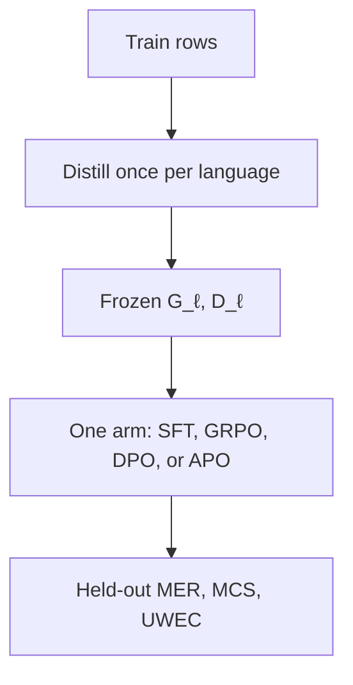
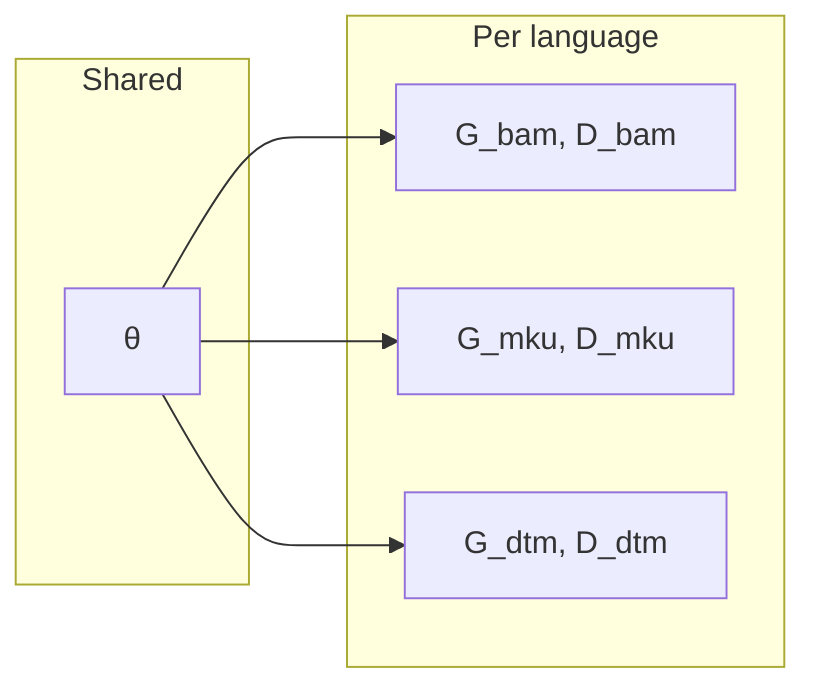
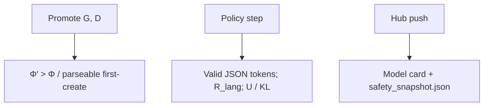

# Architecture

Sebeni is a recursive loop between a rule-based morphological analyzer (Daba)
and a small language model (SLM). Nothing in this page is FastText,
Matryoshka embeddings, or a chatbot — those tracks are out of scope.

Public URL: [https://seben.robotsmali.org/docs](https://seben.robotsmali.org/docs).

## Three product phases

1. **Distill resources** — once per language, on the train split. If Φ is below τ, Distiller proposes a candidate grammar G and dictionary D and promotes them only when Φ′ improves. The result is frozen.
2. **Train one arm** — SFT, GRPO, DPO, or APO reads that frozen checkpoint and starts from the base model. Arms do not promote new G or D.
3. **Evaluate** — held-out `test.json` reports MER, MCS, and UWEC for model \(m\), algorithm \(\mathcal{A}\), and scope \(l\). All three are costs to minimize. MULTI13 pools morphemes (MER) and tokens (MCS, UWEC) across languages.



## One θ, many (G, D)



## SafetyGovernor gates



## Objects

| Symbol | Role |
| --- | --- |
| \(T\) | Alignment dataset: `{text, lang}` rows |
| \(B_ℓ\) | Texts in the batch whose group code is ℓ |
| \(G_ℓ, D_ℓ\) | Daba `.gram` / `.dict` for that group |
| \(\Phi_ℓ\) | Mean token stage score of \(B_ℓ\) given \(G_ℓ, D_ℓ\) |
| \(\tau\) | Default **0.5** |
| \(\theta\) | **One** shared policy, even when \(T\) is multilingual |
| Distiller | Proposes G, D (not `distillation_hook`, which is KL scaling) |

## Package layout

```
beni/
  cli/main.py              sebeni init|distill|train|eval|exp|wordfreq|generate|push
  core/pipeline.py         distill once, one arm, held-out eval
  core/srl/                SFT, GRPO, DPO, APO arms
  core/safety/             SafetyGovernor gates
  core/compute/            Φ, MER, MCS, UWEC (NumPy/JAX kernels), RewardManager
  core/morphotactic/       Distiller, DabaX (CLI daba.mparser)
  core/language.py         ISO → group_code (mku, mey, kao, spp)
  core/hub/                model cards
  core/wordfreq/           surface / lemma / morpheme / stage counts
  data/baselines/{lang}/   packaged G, D (Maninka files may live under mlq/)
  data/raw/dataset_300_samples.jsonl   experiment train split
  data/test.json           packaged eval texts for sebeni exp
  utils/                   workdir, prompts, language metadata
```

Relocatable workdir (later wins): `~/.sebeni` → `SEBENI_HOME` /
`SEBENI_WORKING_DIR` → YAML `working_dir` → CLI `-w`.

| Path under workdir | Contents |
| --- | --- |
| `data/resources/{lang}/` | Frozen G, D after `sebeni distill` |
| `data/baselines/{lang}/` | `baseline.gram` / `.dict`, then `baseline_vN` |
| `models/` | Policy, tokenizer, Hub `README.md`, `safety_snapshot.json` |
| `exp/` | `eval.json`, `manifest.json`, `wordfreq/` |
| `runtime/` | Headless mparser scratch |

## What Sebeni does *not* do

- Vendor GPL `daba` sources (install maslinych/daba from GitHub with
  `--no-deps` for its CLI modules).
- Require wxPython (`[gui]` is optional for upstream gparser).
- Treat G or D as dataset columns.
- Mix languages **inside** one completion JSON object (`R_lang` is 0).
