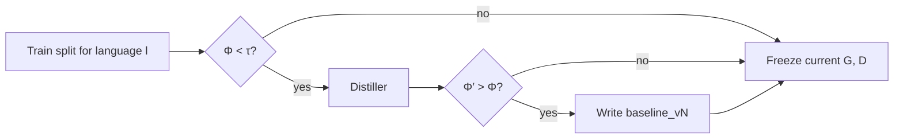

# Distillation and DabaX

Distiller proposes candidate grammar and dictionary files when Φ on a
language's **train split** falls below τ. Sebeni promotes a packaged baseline
only if Φ′ > Φ (and SafetyGovernor agrees). A scratch stub may be written when
it parses. The checkpoint is then frozen. Policy arms do not promote again.



`sebeni distill` is this stage. `sebeni train` runs it only when resources are
not already frozen, then trains one arm. `distillation_hook` is KL scaling,
not Distiller.

## What Distiller writes

Daba-compatible **G** (`.gram` finite-state / Select-Mark rules) and **D**
(`.dict` SIL Toolbox / MDF fields), synthesized from lexical references:

```
pattern select_gloss | mark_gloss
:n: [ :v: :n: ]
```

Heuristic updates decide whether a miss is:

- a missing lemma (`\lx`) in **D**, or
- a missing splitter / constraint in **G** (e.g. `{|na}`).

Promoted files are versioned `baseline_vN` under
`{working_dir}/data/baselines/{lang}/`.

## CLI

```bash
sebeni distill -c config.yaml
sebeni distill -c config.yaml --lang multi13 --hitl
sebeni distill -c config.yaml --lang bam,mku --hitl
```

The default `algorithmic` backend needs no API key. Use `distill` when you want
G, D without a policy step.

## Backends and authentication

```yaml
distillation:
  enabled: true
  backend: algorithmic      # algorithmic | gguf | google | openai | groq | together
  model: gemini-2.5-flash   # LLM backends only
  tau: 0.5
  hitl: false
  # vertex: true            # ADC / Vertex AI; omit to auto-select when ADC is present
  gguf_path: null
  n_ctx: 4096
```

- `algorithmic` builds a DabaX stage −1 miss list and adds conservative `\lx`
  entries. This is the train/exp default.
- `google` uses Vertex/ADC when `vertex: true` or ADC is present
  (`GOOGLE_CLOUD_PROJECT` / application-default credentials). A leftover
  `GOOGLE_API_KEY` does not override ADC. Set `vertex: false` for AI Studio.
- `.env` is loaded from the config directory, workdir, or `SEBENI_ENV`;
  existing process variables win.
- OpenAI-compatible backends accept `base_url` for Ollama/vLLM.
- `gguf` requires `sebeni[gguf]`. Its limited context and lack of hosted
  caching/optimization can reduce quality and throughput.

LLM prompts contain a miss report and bounded format context, never the full
production dictionary.

## Scratch bootstrap

No packaged `beni/data/baselines/{lang}/` → Distiller writes lookup-only stubs
under the workdir. Algorithmic bootstrap adds missing surfaces as lemmas.

| Promote | Gate |
| --- | --- |
| First create | files must be **parseable** by DabaX |
| Later `baseline_vN` | Φ′ > Φ on **that language's** batch texts |

`--hitl` prints a grammar/dictionary head and asks `[y/N]`. Skipped when stdin
is not a TTY (CI).

## DabaX

Wraps CLI `daba.mparser` (`DictLoader`, `GrammarLoader`, `Tokenizer`,
`Processor`). No wxPython / `gparser` / `gdisamb` on the default install.
Upstream credit: [maslinych/daba](https://github.com/maslinych/daba) (GPLv2+).
Install it with
`pip install "daba @ git+https://github.com/maslinych/daba.git" --no-deps`.
Sebeni pins `setuptools` (`pkg_resources`) and the other CLI runtime libraries.
Do not vendor GPL sources into this MIT tree.

```python
from beni.core.morphotactic.distil.distillation import Distiller
from beni.core.morphotactic.dabax import DabaX

d = Distiller(lang_code="bam", backend="algorithmic", working_dir="./runs/bam")
d.handle_baselines()
phi = d.phi_on_texts(["Aw ka kɛnɛ wa?"])

dx = DabaX("bam", gram=d.gram_path, ldict=d.dict_path, process=True)
sentences = dx.loader("Aw ka kɛnɛ wa?")
```

Φ here is morphological integrity of the **strings**, given G and D — the
same quantity SAMPG compares to τ.
