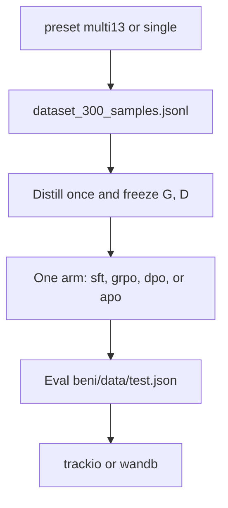

# Experiments

`sebeni exp` is the batteries-included path: distill frozen grammar and
dictionary from the packaged experiment jsonl, train **one** arm, then
evaluate packaged `beni/data/test.json`. Pick a preset and an algorithm.

```bash
sebeni exp --preset multi13 --algorithm sft -w ./runs/multi13-sft
sebeni exp --preset single --lang bam --algorithm grpo -w ./runs/bam-grpo
sebeni exp --preset single --lang bbo --algorithm sft -w ./runs/bbo-sft
# alias: sebeni experiment
```

If `-c` and `--preset` are omitted, Sebeni loads the MULTI13 preset.
`data.source` is **ignored**. The train file is
`beni/data/raw/dataset_300_samples.jsonl`. Codes in that file are remapped
before distillation: `mlq` → `kao`, `hsy` → `mey`, `seq` → `spp`. `bbo` is
kept only for `--lang bbo`.



## What gets loaded

| Split | Source | Language |
| --- | --- | --- |
| Train | `beni/data/raw/dataset_300_samples.jsonl` | experiment remap, then group code |
| Eval | `beni/data/test.json` | object `{lang: text}`; paragraphs split; evaluation only |

`bbo` rows stay in the jsonl and are excluded from MULTI13. A language with no packaged baseline uses Distiller scratch bootstrap. `raw/*.txt` remains available to `sebeni wordfreq` and to `sebeni train` when `experiment.dataset` is `raw`.

Custom `data.source` applies to `sebeni train` / `eval`. Wordfreq uses
`wordfreq.raw_inputs` (with `data.source` as a compatibility fallback).
Only `exp` pins the packaged splits.

## YAML knobs

Edit [`configs/exp.yaml`](https://github.com/mlsftwrs/sebeni/blob/main/configs/exp.yaml):

- `model.model_name` (and LoRA / 4-bit)
- `algorithm: sft | grpo | dpo | apo`
- `trainer.*` (`lr`, `max_steps`, `batch_size`, `num_generations`, …)
- `trainer.report_to: trackio | wandb | none` (default `trackio`)
- Distiller `provider` / `model` / `tau` / `enabled`

```yaml
experiment:
  kveritas: false          # emit KVERITAS_METRIC lines
  kveritas_seal: false     # if kveritas is on PATH, seal {working_dir}/exp/report.pdf
```

`report_to: wandb` needs `pip install "sebeni[train,wandb] @ git+https://github.com/mlsftwrs/sebeni.git"`.
Trackio stays in `[train]`.

## Artifacts

| Path | What |
| --- | --- |
| `{working_dir}/exp/eval.json` | MER, MCS, UWEC, Φ per language and pooled for the scope |
| `{working_dir}/exp/manifest.json` | model, algorithm, scope, seed, resource hashes |
| `{working_dir}/data/resources/{lang}/` | Frozen G, D used by the arm |
| `{working_dir}/models/` | Policy, tokenizer, model card, `safety_snapshot.json` |
| `{working_dir}/data/baselines/{lang}/` | G, D checkpoints |
| tracker | Trackio or Weights & Biases, per `report_to` |

Held-out MER, MCS, and UWEC are the same three costs for every arm. Scope
scores pool reference morphemes (MER) and tokens (MCS, UWEC); a language with
more units weighs more in MULTI13. Reported MCS is the mismatch rate.
Training still uses the match fraction. UWEC is evaluation-only.

## K-Veritas (optional)

Not a hard dependency. After eval, Sebeni can print lines
[K-Veritas](https://kveritas.org/docs) already understands:

```text
KVERITAS_METRIC name=phi value=0.51 step=0
KVERITAS_METRIC name=phi_bam value=0.60 step=0
```

Wrap the run:

```bash
kveritas init
kveritas run -- sebeni exp -c configs/exp.yaml -w ./runs/exp-001
kveritas seal --output ./runs/exp-001/exp/report.pdf
kveritas verify ./runs/exp-001/exp/report.pdf
```

If `experiment.kveritas_seal: true` and the `kveritas` binary exists, Sebeni
calls `kveritas seal` after the run. If missing, it warns with the install URL.
The Go binary is **not** vendored.

## Distiller keys

Same as `sebeni train`: the default algorithmic Distiller needs no key.
Optional Google refinement accepts ADC or `GOOGLE_API_KEY`.

## Next

- [Cookbooks](getting-started.md#cookbooks) for Colab / Kaggle notebooks
- [Use cases](use-cases.md) for your own jsonl
- [SAMPG](sampg.md) for distill → one arm → eval
- [Rewards](rewards.md) for MER, MCS, and UWEC
- [Hyperparameters](hyperparams.md) for every YAML key
