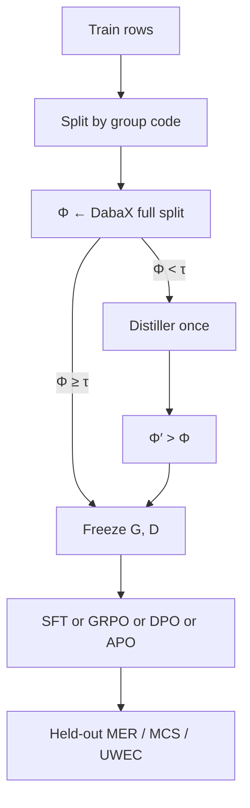

# SAMPG

**Self-Aware Morphotactic Pattern Generation** is the upstream resource step.
`sebeni distill` runs it once per language. `sebeni train` and `sebeni exp`
train one arm only after that checkpoint is frozen. Completions are
morphological analyses (JSON `tokens`), not a chatbot.

## Dataset vs G, D

```
T  = [(text, lang), …]           # jsonl / csv / HF rows / packaged raw
B  ⊂ T                           # a training batch
Φ  = DabaX(texts(B_ℓ), G_ℓ, D_ℓ) # integrity of those strings
```

**G** and **D** are Daba grammar/dictionary files. They are not dataset
fields. Mixed-language batches are split by group code; the policy θ is
still **one** model.

## Loop

1. Split the train rows by language. The experiment file remaps `mlq` → `kao`, `hsy` → `mey`, and `seq` → `spp` before this split.
2. For each language, Φ ← DabaX on that language's full train split.
3. If Φ < τ, Distiller proposes \(G_{cand}, D_{cand}\). Promote when Φ′ > Φ. A scratch stub may be written when it parses.
4. Freeze baseline and distilled G, D under `{working_dir}/data/resources/{lang}/`.
5. One arm reads that checkpoint: SFT extracts labels, or GRPO / DPO / APO builds its training rows. None of them write a new G or D.
6. Score completions against the frozen DabaX parse. U scales the policy update. U is not a reward and it is not Distiller.



`distillation_hook` is **KL scaling**, not Distiller. Policy steps do not call Distiller.

YAML `algorithm: sft | grpo | dpo | apo` selects the arm.
Register another with `register_algorithm(name, cls)`.

## Φ (morphological integrity)

Daba assigns a **stage** to each token:

| Stage | Meaning | Contribution to Φ |
| --- | --- | --- |
| \(0 \le x < 6\) | Fully matched / analyzed | 1.0 |
| 6 (EMPR) | Validated loanword / borrowing | `empr` (default 0.5) |
| −1 | Unrecognized | 0.0 |

Φ is the mean token score (recognized segments / tokens). If **Φ < 0.5**,
Distiller runs. It decides whether the miss is a missing lemma (`\lx`) or a
missing splitter / constraint (e.g. `{|na}`).

## Rewards

\[
R_{\mathrm{total}} = \omega_m R_{\mathrm{morph}} + \omega_r R_{\mathrm{rule}} + \omega_f R_{\mathrm{format}} + \omega_l R_{\mathrm{lang}}
\]

Default weights: \(R_{morph}=0.4\), \(R_{rule}=0.4\), \(R_{format}=0.1\),
\(R_{lang}=0.1\) (sum **1.0**).
Sebeni requires JSON `lang` to match **that row**.

- \(R_{morph}\): mean Daba stage score on completion tokens; stage −1 is
  heavily penalized.
- \(R_{rule}\): finite-state transitions from **G** (Select-Mark, valence
  `\vl`, lemma `\lx` / POS `\ps` vs **D**). Details: [Rewards](rewards.md).
- \(R_{format}\): valid **JSON** with a `tokens` list.
- \(R_{lang}\): JSON `lang` matches that row's group code.

## JSON completion schema

```json
{
  "text": "aw ka ne labato.",
  "lang": "bam",
  "tokens": [
    {
      "surface": "aw",
      "stage": 1,
      "analyses": [
        {
          "form": "áw",
          "ps": ["prn"],
          "gloss": "2sg",
          "morphemes": []
        }
      ]
    }
  ]
}
```

`lang` is the group code for **this sentence**. Do not mix languages inside
one JSON object.

## Policy-update plugins

| YAML `algorithm` | Class | TRL |
| --- | --- | --- |
| `sft` | `SebeniSft` | `SFTTrainer` |
| `grpo` | `SebeniGrpo` | `GRPOTrainer` |
| `dpo` | `SebeniDpo` | `DPOTrainer` |
| `apo` | `SebeniApo` | Anchored Preference Optimization ([APO](https://huggingface.co/papers/2408.06266)): `DPOTrainer` + `apo_zero` / `apo_down` |

DPO/APO pairs: `chosen`/`rejected` or `completions`+`scores`.
For raw `{text, lang}` rows Sebeni builds `chosen=y*` and a legal corrupted
JSON negative; it never uses raw text as chosen or an empty rejected value.

```python
from beni.core.srl.unified import register_algorithm, SRLTrainer

register_algorithm("my_gc", MyPlugin)  # then YAML algorithm: my_gc
```

TRL notes: `GRPOTrainer` has no `ref_model` constructor argument (assign
after init); PEFT adapters are disabled on the reference; `beta` lives on
`GRPOConfig`.

## Multilingual

```yaml
data:
  default_lang: bam
  languages: [bam, mku, dtm]
```

```bash
sebeni init --lang bam,mku,dtm -w ./runs/manding-001
sebeni train -c ./runs/manding-001/config.yaml
```

- One language identity per sentence.
- Φ / Distiller / G, D per group (**mku** not mlq).
- `R_lang` vs **that row**.
- Mixing languages inside one JSON object scores 0.

Example config: `configs/grpo_multilang.yaml`.
